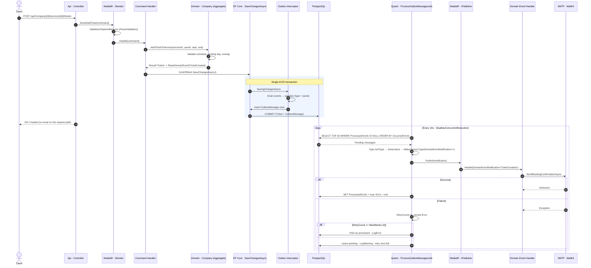

# Book1fy API

<p align="left">
  
  
  
  
  
  
  
  
</p>

A multi-tenant appointment-booking REST API. Companies register on the platform, publish bookable **services** with weekly schedules and pricing, and customers reserve time slots as **tickets** — with slot overlap, working-day, and opening-hours validation enforced inside the domain model rather than at the edges. Every state change that matters (user registered, company created, ticket booked, ticket cancelled) is captured as a domain event and delivered asynchronously through a **transactional outbox**, so transactional emails never ride on the request thread and never fire for a transaction that rolled back.

---

## 🧰 Tech Stack & Tooling

| Layer | Technology | Version | Role |
| :--- | :--- | :--- | :--- |
| **Runtime** | .NET / ASP.NET Core | `10.0` | Web host, DI container, configuration, logging |
| **Language** | C# | `14` | Nullable reference types + implicit usings enabled solution-wide |
| **Persistence** | Entity Framework Core | `10.0.0` | ORM, migrations, change tracking, `SaveChanges` interceptors |
| **Database** | PostgreSQL (`Npgsql.EntityFrameworkCore.PostgreSQL`) | `10.0.0` | Relational store; `jsonb` column for outbox payloads |
| **Messaging (in-process)** | MediatR | `14.2.0` | CQRS dispatch (`ISender`) and event fan-out (`IPublisher`) |
| **Scheduling** | Quartz.NET + `Quartz.Extensions.Hosting` | `3.19.1` | Hosted background job that drains the outbox |
| **Validation** | FluentValidation (+ DI extensions) | `12.1.1` | Request validators executed by a MediatR pipeline behavior |
| **AuthN / AuthZ** | `Microsoft.AspNetCore.Authentication.JwtBearer` · `Microsoft.IdentityModel.JsonWebTokens` | `10.0.0` / `8.22.0` | Symmetric-key JWT bearer tokens |
| **Hashing** | BCrypt.Net-Next | `4.2.0` | Password hashing behind a domain-owned `IPasswordHasher` |
| **Email** | MailKit / MimeKit | `4.17.0` | SMTP over StartTLS, HTML templates rendered from disk |
| **API surface** | `Microsoft.AspNetCore.OpenApi` | `10.0.9` | OpenAPI document generation |
| **Containers** | Docker · Docker Compose | — | Multi-stage `Api/Dockerfile` on `aspnet:10.0` / `sdk:10.0` |

---

## 🏛️ Architecture & Design Principles

The solution is four projects with a strictly inward-pointing dependency graph — the compiler, not convention, enforces the boundaries.

```
Api ──────────┐
              ├──▶ Application ──▶ Domain
Infrastructure┘
```

| Project | Depends on | Contains |
| :--- | :--- | :--- |
| **`Domain`** | *nothing* | Entities, aggregate roots, value objects, domain events, error catalogs, repository interfaces, `Result` primitives |
| **`Application`** | `Domain` | Commands, queries, handlers, validators, event handlers, pipeline behaviors, port interfaces (`IEmailService`, `IJwtTokenGenerator`, `IUserContext`) |
| **`Infrastructure`** | `Application` | EF Core `DbContext`, configurations, migrations, repositories, read-model queries, SMTP adapter, JWT generator, Quartz jobs, outbox |
| **`Api`** | `Application` + `Infrastructure` | Controllers, request DTOs, JWT wiring, global exception handler, composition root |

`Domain.csproj` carries **zero `PackageReference` entries**. The domain has no knowledge of EF Core, MediatR, HTTP, or JSON.

### 🧩 Domain-Driven Design

- 🔒 **Aggregate boundaries are real.** `Company` is the aggregate root for `Service` and `Ticket`. Both children expose `internal` factories and mutators — `Service.Create`, `Ticket.Create`, `Ticket.CancelReservation` are unreachable from `Application`. The only way to book a slot is `company.AddTicketToService(...)`, which keeps invariant checks and event publication in one place.
- ✅ **Invariants live in the model.** `Service.IsTicketValid` rejects inverted time ranges, past start times, non-working days, cross-midnight bookings, out-of-hours bookings, and overlaps against currently `Reserved` tickets. `Service.IsScheduleValid` rejects out-of-range or inverted opening hours, empty working-day sets, and negative prices.
- 💎 **Value objects with validating factories.** `Email`, `FullName`, and `Password` are `sealed record`s with private constructors and `static Result<T> Create(...)`. `Password` never holds plaintext — it hashes on construction through the injected `IPasswordHasher`.
- 📣 **Domain events raised, not dispatched.** `AggregateRoot` accumulates `IDomainEvent` instances in a private list; the aggregate never touches a publisher. Dispatch is an infrastructure concern (see below).
- 🚫 **Errors are values, not exceptions.** `Result` / `Result<T>` plus a `record Error(string Code, string? Message, HttpStatusCode StatusCode)` model expected failures. Static catalogs (`TicketErrors`, `CompanyErrors`, `PasswordErrors`, …) keep codes and HTTP semantics beside the rule that produces them. Implicit conversion from `Error` to `Result` keeps handlers terse.

### ⚡ CQRS with MediatR

- **Write side** — `ICommand<T> : IRequest<Result<T>>` and `ICommandHandler<TCommand, TResponse>`. Handlers load an aggregate through a repository, invoke a domain method, and commit via `IUnitOfWork`.
- **Read side** — `IQuery<T>` handlers bypass repositories entirely and depend on `ICompanyQueries` / `IUserQueries`. Their implementations project straight from `AsNoTracking()` LINQ into flat response records — no aggregate materialization, no mapper layer, no lazy loading.
- **Cross-cutting validation** — `ValidationPipelineBehavior<TRequest, TResponse>` runs every registered `IValidator<TRequest>` concurrently, aggregates failures into `Error[]`, and short-circuits with a `ValidationResult` before the handler executes. Because `TResponse` is constrained to `Result`, the behavior uses reflection to build the correct closed `ValidationResult<T>`.
- **Error translation at the edge** — `ApiController.HandleFailure` pattern-matches the failed `Result` into an RFC 7807 `ProblemDetails`, mapping validation failures to `400` with an `errors` extension and everything else to the status code carried on the `Error` itself. Unhandled exceptions are caught by `GlobalExceptionHandler` (`IExceptionHandler`) and logged before returning a sanitized `500`.

---

## 📤 Outbox Pattern & Resilience

Sending an email inside the same call that writes to the database means either the email fires for a transaction that later rolls back, or a dead SMTP server takes the HTTP request down with it. This project cuts that coupling with a transactional outbox.

### 1️⃣ Capture — `ConvertDomainEventsToOutboxMessagesInterceptor`

A `SaveChangesInterceptor` registered on the `DbContext`. On `SavingChangesAsync` it walks the change tracker for `AggregateRoot` entries holding events, drains them, and serializes each into an `OutboxMessage`:

```csharp
Type    = domainEvent.GetType().AssemblyQualifiedName!,   // for later reconstruction
Content = JsonSerializer.Serialize(domainEvent, domainEvent.GetType())
```

The rows are added to the **same `DbContext`**, so they land in the **same transaction** as the business data. Either the ticket and its event row both commit, or neither does. `Content` is mapped to a PostgreSQL `jsonb` column, and a composite index on `(ProcessedOnUtc, OccurredOnUtc)` keeps the poll query cheap.

### 2️⃣ Drain — `ProcessOutboxMessagesJob`

A Quartz `IJob` marked `[DisallowConcurrentExecution]`, triggered every **10 seconds** with `RepeatForever`. The hosted service is configured with `WaitForJobsToComplete = true` so an in-flight batch finishes during shutdown.

- 📦 **Bounded FIFO batches** — `BatchSize = 20`, filtered on `ProcessedOnUtc == null` and ordered by `OccurredOnUtc`, so the oldest unprocessed events go first and a backlog can never blow up a single execution.
- 🔁 **Bounded retry** — failures increment `RetryCount` and persist the full exception into `Error`. Below `MaxRetries = 3` the message stays unprocessed and is naturally re-picked by the next tick. On the third failure it is stamped `ProcessedOnUtc` and parked as a poison message, leaving the exception text on the row for forensics instead of looping forever.
- 🧾 **Structured logging** — retryable failures log at `Warning`, exhausted ones at `Error`, both with `{MessageId}`, `{MessageType}`, and `{RetryCount}` as named properties rather than interpolated strings, so they stay queryable in any structured sink.
- 💾 **Per-message checkpointing** — `SaveChangesAsync` is called after each message, inside the loop. One failure never rolls back the successes that preceded it in the batch.
- ⛔ **Cooperative cancellation** — `context.CancellationToken` is threaded through the query, the publish, and every save.

### 3️⃣ Dispatch — dynamic generic resolution via reflection

The outbox stores an opaque type name and a JSON blob; MediatR needs a strongly-typed `INotification`. `PublishAsync` bridges the two at runtime:

```csharp
Type domainEventType = Type.GetType(outboxMessage.Type)
    ?? throw new InvalidOperationException($"Unknown domain event type: {outboxMessage.Type}");

var domainEvent = JsonSerializer.Deserialize(outboxMessage.Content, domainEventType);

var notificationType = typeof(DomainEventNotification<>).MakeGenericType(domainEventType);
var notification     = Activator.CreateInstance(notificationType, domainEvent);

await publisher.Publish((INotification)notification, cancellationToken);
```

`DomainEventNotification<TDomainEvent>` is the generic envelope that lets a raw `IDomainEvent` cross into MediatR without the `Domain` project ever referencing MediatR. Handlers implement the marker interface `IDomainEventHandler<TEvent> : INotificationHandler<DomainEventNotification<TEvent>>` — adding a new reaction to an existing event means adding one class, with no change to the job, the interceptor, or any registration code.

**Registered handlers:** `SendWelcomeEmailHandler` · `SendCompanyOnboardingHandler` · `SendBookingConfirmationHandler` · `SendBookingCancellationHandler` · `NotifyOwnerOfCancellationHandler`.

---

## 🔄 Visual Architecture Flow



---

## 📁 Project Structure

```
Book1fy-API.sln
│
├── Domain/                        # Zero dependencies — pure business model
│   ├── Entities/                  # User, Company (roots) · Service, Ticket (children)
│   ├── ValueObjects/              # Email, FullName, Password
│   ├── DomainEvents/              # UserCreated, CompanyCreated, TicketCreated, TicketCancelled
│   ├── Primitives/                # Entity, AggregateRoot, IDomainEvent
│   ├── Shared/                    # Result, Result<T>, Error, ValidationResult
│   ├── Errors/                    # Per-concept error catalogs
│   ├── Repositories/              # IUserRepository, ICompanyRepository, IUnitOfWork
│   └── Abstractions/              # IPasswordHasher
│
├── Application/                   # Use cases — depends only on Domain
│   ├── Common/Abstractions/       # ICommand/IQuery, DomainEventNotification<>, ports
│   ├── Behaviors/                 # ValidationPipelineBehavior
│   ├── Users/                     # Commands · Queries · EventHandlers
│   └── Companies/                 # Commands · Queries · EventHandlers
│
├── Infrastructure/                # Adapters — depends on Application
│   ├── Persistence/
│   │   ├── Configurations/        # IEntityTypeConfiguration<> per aggregate + outbox
│   │   ├── Interceptors/          # ConvertDomainEventsToOutboxMessagesInterceptor
│   │   ├── Outbox/                # OutboxMessage
│   │   ├── Repositories/          # Write-side aggregate loading
│   │   └── Queries/               # Read-side projections (AsNoTracking)
│   ├── BackgroundJobs/            # ProcessOutboxMessagesJob
│   ├── Authentication/            # JwtTokenGenerator, PasswordHasher (BCrypt)
│   ├── Email/                     # SmtpEmailService + HTML templates
│   └── Migrations/                # EF Core migration history
│
└── Api/                           # Composition root + HTTP surface
    ├── Controllers/               # CompanyController, UsersController
    ├── Abstractions/              # ApiController — Result → ProblemDetails
    ├── Authentication/            # UserContext (resolves `sub` claim)
    ├── Middleware/                # GlobalExceptionHandler
    ├── Extensions/                # JWT bearer configuration
    └── Program.cs
```

---

## 🔐 Authentication & Security

- **JWT bearer**, signed with `HmacSha256` from a symmetric key. Issuer, audience, lifetime, and signing key are all validated, with `ClockSkew = TimeSpan.Zero` — expiry means expiry.
- `MapInboundClaims = false` keeps raw JWT claim names (`sub`, `email`, `jti`) instead of remapping them to legacy `ClaimTypes.*` URIs.
- `ApiController` is `[Authorize]` by default; only `register` and `login` opt out with `[AllowAnonymous]`.
- `IUserContext` reads the caller's identity from the `sub` claim, so handlers never trust a user id sent in the request body — `CreateCompanyCommandHandler` and `AddTicketCommandHandler` both take ownership from the token.
- Passwords are BCrypt-hashed inside the `Password` value object and must be ≥ 8 characters with an uppercase letter, a digit, and a non-alphanumeric character.
- Email template placeholders are `WebUtility.HtmlEncode`-escaped before substitution.

---

## 🌐 API Surface

| Method | Route | Auth | Description |
| :--- | :--- | :---: | :--- |
| `POST` | `/api/Users/register` | — | Register a user, returns a JWT |
| `POST` | `/api/Users/login` | — | Authenticate, returns a JWT |
| `GET` | `/api/Users/{id:guid}` | 🔒 | Fetch a user by id |
| `GET` | `/api/Users/email/{email}` | 🔒 | Fetch a user by email |
| `POST` | `/api/Company` | 🔒 | Create a company owned by the caller |
| `GET` | `/api/Company/{id:guid}` | 🔒 | Company with its services |
| `POST` | `/api/Company/{companyId}/services` | 🔒 | Add a bookable service |
| `GET` | `/api/Company/{companyId}/services/{serviceId}` | 🔒 | Service detail |
| `POST` | `/api/Company/{companyId}/services/{serviceId}/tickets` | 🔒 | Book a slot |
| `GET` | `/api/Company/{companyId}/services/{serviceId}/tickets/{ticketId}` | 🔒 | Ticket detail |
| `DELETE` | `/api/Company/{companyId}/services/{serviceId}/tickets/{ticketId}` | 🔒 | Cancel a reservation |

Failures return `application/problem+json` (RFC 7807) with the domain error code in `type`.

---

## 🚀 Getting Started

### Prerequisites

- .NET SDK **10.0**
- PostgreSQL instance
- SMTP credentials (the app uses StartTLS on the configured host/port)

### Configuration

`appsettings.json` ships with empty secrets by design. The API **throws on startup** if `ConnectionStrings:DefaultConnection` is missing. Supply values via user secrets (the `Api` project has `UserSecretsId` configured), environment variables, or your deployment's secret store:

```bash
dotnet user-secrets set "ConnectionStrings:DefaultConnection" "Host=localhost;Database=book1fy;Username=postgres;Password=..." --project Api
dotnet user-secrets set "JwtSettings:Secret" "<32+ byte signing key>" --project Api
dotnet user-secrets set "SmtpSettings:SenderEmail" "no-reply@example.com" --project Api
dotnet user-secrets set "SmtpSettings:Password"    "<app password>"      --project Api
```

Remaining knobs: `JwtSettings:Issuer`, `JwtSettings:Audience`, `JwtSettings:ExpiryMinutes`, `SmtpSettings:Host`, `SmtpSettings:Port`, `SmtpSettings:SenderName`.

### Run

```bash
dotnet restore
dotnet ef database update --project Infrastructure --startup-project Api
dotnet run --project Api                      # https://localhost:7015 · http://localhost:5099
```

### Docker

```bash
docker compose up --build                     # multi-stage build, exposes 8080/8081
```
